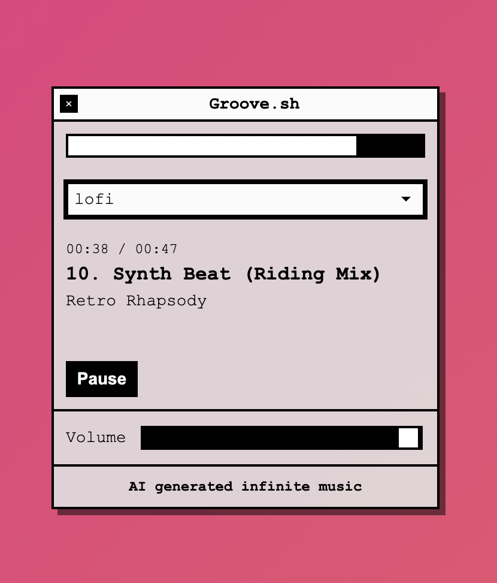

# Groove.sh



Groove.sh plays AI generated music, infinitely. It uses stable-audio 1.0 for generation by making use of the FAL.ai api for it. It was inspired by https://github.com/kennethnym/infinifi

## Installation

You need `pipenv` to install the requirements. Once you install pipenv by `pip install pipenv`, you can install the dependencies by doing

```
cd folder/where/you/cloned/repo
pipenv install
```

## Song generation

Songs are generated using the `inference.py` script, which in turn uses [FAL.ai](https://fal.ai)'s API for stable-audio. In order to use the API, you need an API key from FAL.ai. Once you have it, create a .env file with your API key (You can refer to `.env_example` file).

Once you have the API key set in the `.env` file, run
```
python inference.sh <genre> <num_songs>
```
Genre would be what all genres you have inside `prompts.json`. Right now it's `lofi` and `techno`

This would download the songs to the music directory in the appropriate subfolders.

## Running the server

Once you have enough songs generated, you can run the server by doing

```
fastapi dev server.py --host 0.0.0.0 --port 8000
```

You should be able to access your server at `localhost:8000`

## Misc:

Licensed under MIT license
Thanks to @kennethnym for the inspiration.